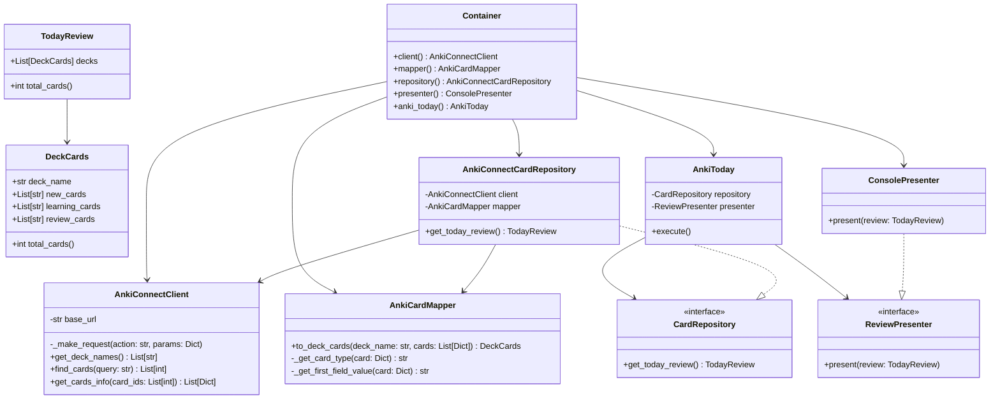

```mermaid
classDiagram
    %% Core Layer - Domain Entities
    class DeckCards {
        +str deck_name
        +List[str] new_cards
        +List[str] learning_cards
        +List[str] review_cards
        +int total_cards()
    }
    class TodayReview {
        +List[DeckCards] decks
        +int total_cards()
    }

    %% Core Layer - Ports/Interfaces
    class CardRepository {
        <<interface>>
        +get_today_review() TodayReview
    }
    class ReviewPresenter {
        <<interface>>
        +present(review: TodayReview)
    }

    %% Infrastructure Layer
    class AnkiConnectClient {
        -str base_url
        -_make_request(action: str, params: Dict)
        +get_deck_names() List[str]
        +find_cards(query: str) List[int]
        +get_cards_info(card_ids: List[int]) List[Dict]
    }
    class AnkiCardMapper {
        +to_deck_cards(deck_name: str, cards: List[Dict]) DeckCards
        -_get_card_type(card: Dict) str
        -_get_first_field_value(card: Dict) str
    }
    class AnkiConnectCardRepository {
        -AnkiConnectClient client
        -AnkiCardMapper mapper
        +get_today_review() TodayReview
    }

    %% Application Layer
    class AnkiToday {
        -CardRepository repository
        -ReviewPresenter presenter
        +execute()
    }
    class ConsolePresenter {
        +present(review: TodayReview)
    }
    class Container {
        +client() AnkiConnectClient
        +mapper() AnkiCardMapper
        +repository() AnkiConnectCardRepository
        +presenter() ConsolePresenter
        +anki_today() AnkiToday
    }

    %% Relationships
    TodayReview --> DeckCards
    AnkiConnectCardRepository ..|> CardRepository
    ConsolePresenter ..|> ReviewPresenter
    AnkiConnectCardRepository --> AnkiConnectClient
    AnkiConnectCardRepository --> AnkiCardMapper
    AnkiToday --> CardRepository
    AnkiToday --> ReviewPresenter
    Container --> AnkiConnectClient
    Container --> AnkiCardMapper
    Container --> AnkiConnectCardRepository
    Container --> ConsolePresenter
    Container --> AnkiToday

%% Comments explaining the architecture
%% The application follows Clean Architecture principles with three main layers:
%% 1. Core Layer: Contains domain entities (DeckCards, TodayReview) and interfaces (CardRepository, ReviewPresenter)
%% 2. Infrastructure Layer: Contains implementations for external services (AnkiConnect) and data mapping
%% 3. Application Layer: Contains use cases, presentation logic, and dependency injection
%%
%% Key patterns used:
%% - Repository Pattern: For data access abstraction
%% - Mapper Pattern: For data transformation
%% - Dependency Injection: For loose coupling
%% - Presenter Pattern: For presentation logic separation
``` 