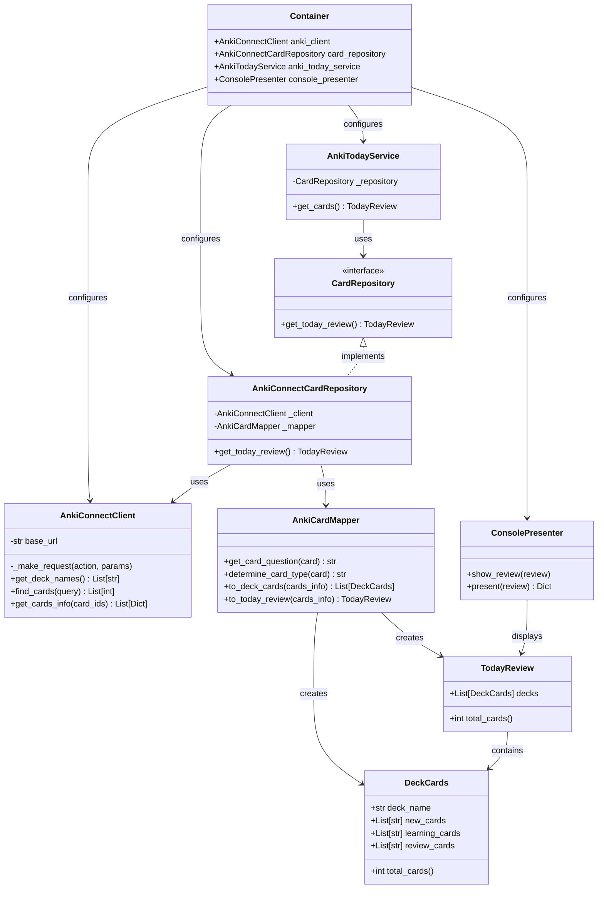

```mermaid
classDiagram
    %% Core Layer (Domain)
    class DeckCards {
        +str deck_name
        +List[str] new_cards
        +List[str] learning_cards
        +List[str] review_cards
        +int total_cards()
    }
    class TodayReview {
        +List[DeckCards] decks
        +int total_cards()
    }
    class CardRepository {
        <<interface>>
        +get_today_review() TodayReview
    }

    %% Infrastructure Layer
    class AnkiConnectClient {
        -str base_url
        -_make_request(action, params)
        +get_deck_names() List[str]
        +find_cards(query) List[int]
        +get_cards_info(card_ids) List[Dict]
    }
    class AnkiCardMapper {
        +get_card_question(card) str
        +determine_card_type(card) str
        +to_deck_cards(cards_info) List[DeckCards]
        +to_today_review(cards_info) TodayReview
    }
    class AnkiConnectCardRepository {
        -AnkiConnectClient _client
        -AnkiCardMapper _mapper
        +get_today_review() TodayReview
    }

    %% Application Layer
    class AnkiTodayService {
        -CardRepository _repository
        +get_cards() TodayReview
    }
    class ConsolePresenter {
        +show_review(review)
        +present(review) Dict
    }
    class Container {
        +AnkiConnectClient anki_client
        +AnkiConnectCardRepository card_repository
        +AnkiTodayService anki_today_service
        +ConsolePresenter console_presenter
    }

    %% Relationships
    CardRepository <|.. AnkiConnectCardRepository : implements
    AnkiConnectCardRepository --> AnkiConnectClient : uses
    AnkiConnectCardRepository --> AnkiCardMapper : uses
    AnkiCardMapper --> DeckCards : creates
    AnkiCardMapper --> TodayReview : creates
    AnkiTodayService --> CardRepository : uses
    ConsolePresenter --> TodayReview : displays
    Container --> AnkiConnectClient : configures
    Container --> AnkiConnectCardRepository : configures
    Container --> AnkiTodayService : configures
    Container --> ConsolePresenter : configures
    TodayReview --> DeckCards : contains

%% Explanatory Comments
%% The application follows a clean architecture with three main layers:
%% 1. Core (Domain) Layer:
%%    - Contains domain entities (DeckCards, TodayReview)
%%    - Defines interfaces (CardRepository)
%%    - Has no dependencies on other layers
%%
%% 2. Infrastructure Layer:
%%    - Implements core interfaces
%%    - Handles external communication (AnkiConnectClient)
%%    - Maps external data to domain entities (AnkiCardMapper)
%%
%% 3. Application Layer:
%%    - Orchestrates use cases (AnkiTodayService)
%%    - Handles presentation (ConsolePresenter)
%%    - Manages dependencies (Container)
%%
%% Key Design Patterns:
%% - Repository Pattern: Abstracts data access
%% - Mapper Pattern: Handles data transformation
%% - Dependency Injection: Manages dependencies
%% - Presenter Pattern: Separates display logic
``` 